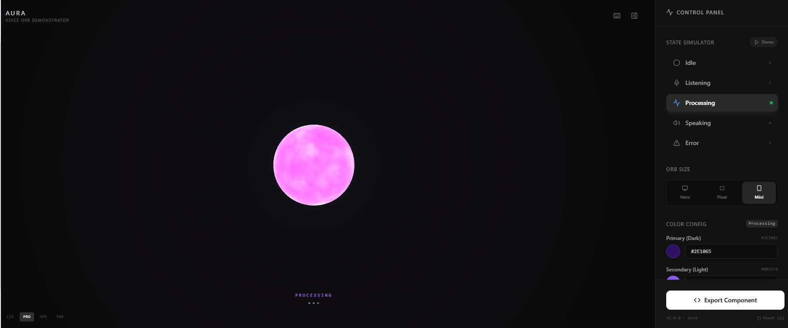

# Aura

A real-time interactive Voice Orb component built during the Figma Makeathon.



## Demo Video

<div style="position: relative; padding-bottom: 56.25%; height: 0;"><iframe src="https://www.loom.com/embed/ef5f89a371454993ab092360612a8a84" frameborder="0" webkitallowfullscreen mozallowfullscreen allowfullscreen style="position: absolute; top: 0; left: 0; width: 100%; height: 100%;"></iframe></div>

If your Markdown renderer blocks iframes, watch here:
https://www.loom.com/share/ef5f89a371454993ab092360612a8a84

## What This Includes

- WebGL orb renderer (Three.js) with animated shader effects
- Automatic Canvas 2D fallback when WebGL is unavailable
- Built-in states: `idle`, `listening`, `processing`, `speaking`, `error`
- Configurable colors, animation speed, and intensity per state
- Interactive demo controls and keyboard shortcuts

## Quick Start

```bash
npm install
npm run dev
```

Build for production:

```bash
npm run build
npm run preview
```

## Component Usage

The component is in `src/app/components/VoiceOrb.tsx`.

Example:

```tsx
import { useState } from 'react';
import { VoiceOrb } from './app/components/VoiceOrb';
import { INITIAL_CONFIG } from './app/constants';
import type { OrbState } from './app/types';

export default function Demo() {
	const [currentState, setCurrentState] = useState<OrbState>('idle');

	return (
		<div className="relative h-[500px] w-full bg-black">
			<VoiceOrb
				currentState={currentState}
				config={INITIAL_CONFIG}
				size="hero"
			/>

			<button onClick={() => setCurrentState('listening')}>
				Listening
			</button>
		</div>
	);
}
```

## Props

- `currentState`: `OrbState` (`idle | listening | processing | speaking | error`)
- `config`: `Record<OrbState, OrbStateConfig>`
- `size`: `'hero' | 'float' | 'mini'`

## Usability Check

The current codebase is usable for others with minimal setup:

- Entrypoint is correctly wired (`index.html` -> `src/main.tsx` -> `App`)
- `VoiceOrb` is already exported and typed
- Fallback rendering exists for non-WebGL environments
- Run scripts now include `dev`, `build`, and `preview` for easier onboarding

Main thing users need is this import path and required props:

- `src/app/components/VoiceOrb.tsx`
- `src/app/types.ts`
- `src/app/constants.ts`

## Tech Stack

- React 18
- TypeScript
- Vite
- Three.js
- Tailwind CSS
